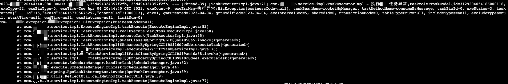
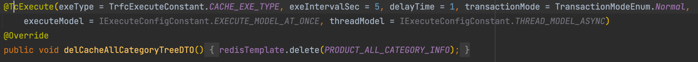

# 1.什么是ark-tc？
ark-tc是ark系列框架中的事务补偿框架，tc即是Transaction Compensating。
# 2.ark-tc解决了什么问题？
&emsp;&emsp;通常在核心业务流程中存在发送MQ，发起rpc调用第三方，插入db存储，刷新es等场景，如：在生单流程中，需要在保存DB后发送一条mq消息。而以上这些场景是需要保证一定要执行的。当机器遇到宕机这类故障后，这些任务则有几率不会被执行。</br>
&emsp;&emsp;为了解决以上为题，通常的做法是每个业务写一个任务表定期执行。但是这样做带来的问题是巨多的业务表，维护和操作也不方便，重复的操作逻辑也会散落在各个业务工程中。</br>
&emsp;&emsp;tc框架则是为了解决以上问题而生的，它会把需要执行的任务持久化到db中，然后不断的异步的重试补偿动作。
# 3.ark-tc使用场景
- 最终一致性场景
  - 更新完DB后，异步发mq消息的场景
  - 更新完DB后，刷新（删除）cache的场景
  - 更新完DB后，刷新异构数据，如es的场景
- 强一致性场景
  - 如写完DB后必须发送mq成功，否则需要回滚DB
  - 如写完DB后必须刷新cache成功，否则需要回滚DB
  - 如写完DB后必须同步异构数据成功，否则需要回滚DB

# 4.ark-tc功能列表
- 可以实现支持配置化接口
- 可以支持业务类型、业务ID存入
- 可以支持动态表名或者用户自定义表名
- 可以支持不用应用环境隔离
- 可支持动态便捷后台服务操作
# 5.ark-tc如何使用？
> 1. 建表（见sql文件夹）
> 2. pom文件引入依赖
> ```
> <dependency>
>  <groupId>com.ark</groupId>
>  <artifactId>ark-tc</artifactId>
>  <version>1.1</version>
> </dependency>
>```
> 3. application.yml添加ark-tc参数配置：
> ```
> tc:
>    #控制台配置
>    adminPassword: 21232f297a57a5a743894a0e4a801fc3
>    adminUserName: admin
>   #环境标记
>    env: 1
>   #删除10天前的历史记录
>    jobCanDelHistoryDays: 10
>   #任务最大丢弃时间（分钟）
>    jobMaxAbandonMinute: 15
>```
# 6.ark-tc 功能截图
- 线上补偿失败则继续补偿：
  <div align="left">
    
  </div>
- 使用便捷，一个annotation即可实现补偿：
  <div align="left">
    
  </div>